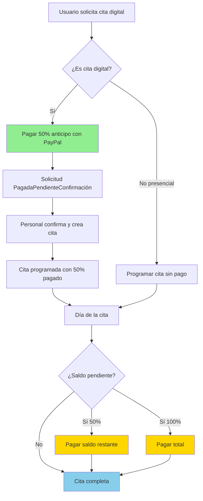

# ?? Guía de API - Gestión de Pagos Pendientes de Citas

## ?? Índice
1. [Visión General](#visión-general)
2. [Flujo de Pagos](#flujo-de-pagos)
3. [Endpoints Disponibles](#endpoints-disponibles)
4. [Casos de Uso](#casos-de-uso)
5. [Ejemplos de Implementación](#ejemplos-de-implementación)
6. [Manejo de Errores](#manejo-de-errores)

---

## Visión General

El sistema de pagos de AdoPets soporta dos tipos de flujo para citas:

### ?? Citas Digitales (Online)
- **Requiere anticipo del 50%** antes de confirmar
- El usuario paga el 50% mediante PayPal al crear la solicitud
- El 50% restante se paga el día de la cita (puede ser en efectivo o PayPal)

### ?? Citas Presenciales (Walk-in)
- **No requiere anticipo**
- Se paga el 100% el día de la cita

---

## Flujo de Pagos



---

## Endpoints Disponibles

### 1. Ver Pagos de una Cita Específica

**Propósito:** Obtener todos los pagos asociados a una cita para ver cuánto se ha pagado y cuánto falta.

```http
GET /api/v1/Pagos/cita/{citaId}
Authorization: Bearer {token}
```

**Ejemplo de Request:**
```javascript
const citaId = "550e8400-e29b-41d4-a716-446655440000";

const response = await fetch(`https://api.adopets.com/api/v1/Pagos/cita/${citaId}`, {
  headers: {
    'Authorization': `Bearer ${accessToken}`,
    'Content-Type': 'application/json'
  }
});

const data = await response.json();
```

**Respuesta Exitosa (200 OK):**
```json
{
  "success": true,
  "message": "Se encontraron 1 pago(s) para la cita",
  "data": [
    {
      "id": "pago-guid-1",
      "numeroPago": "PAY-20240115-1234",
      "usuarioId": "usuario-guid",
      "nombreUsuario": "Juan Pérez García",
      "monto": 609.00,
      "moneda": "MXN",
      "tipo": 2,
      "tipoNombre": "Anticipo",
      "metodo": 1,
      "metodoNombre": "PayPal",
      "estado": 3,
      "estadoNombre": "Completado",
      "fechaPago": "2024-01-15T14:50:00Z",
      "concepto": "Anticipo 50% - Esterilización para Max",
      "citaId": "550e8400-e29b-41d4-a716-446655440000",
      "esAnticipo": true,
      "montoTotal": 1218.00,
      "montoRestante": 609.00,
      "createdAt": "2024-01-15T14:48:00Z"
    }
  ]
}
```

**Interpretación de la respuesta:**
- `esAnticipo: true` ? Es un pago de anticipo del 50%
- `montoTotal: 1218.00` ? Costo total del servicio
- `monto: 609.00` ? Lo que se pagó en este pago
- `montoRestante: 609.00` ? Lo que falta por pagar

---

### 2. Ver TODAS las Citas con Pagos Pendientes

**Propósito:** Obtener un resumen de todas las citas que tienen pagos pendientes (para recepcionistas/admins).

```http
GET /api/v1/Pagos/pendientes
Authorization: Bearer {token}
```

**Roles permitidos:** Admin, Veterinario, Recepcionista

**Respuesta Exitosa (200 OK):**
```json
{
  "success": true,
  "message": "Se encontraron 3 cita(s) con pagos pendientes",
  "data": [
    {
      "citaId": "cita-guid-1",
      "numeroCita": "CITA-20240115-0001",
      "fechaCita": "2024-02-15T10:00:00Z",
      "nombreMascota": "Max",
      "nombrePropietario": "Juan Pérez García",
      "propietarioId": "usuario-guid-1",
      "servicioDescripcion": "Esterilización",
      
      "pagoAnticipoId": "pago-guid-1",
      "montoAnticipoPagado": 609.00,
      "fechaPagoAnticipo": "2024-01-15T14:50:00Z",
      
      "montoTotal": 1218.00,
      "montoPendiente": 609.00,
      "porcentajePagado": 50.0,
      
      "tieneAnticipoPagado": true,
      "estadoPago": "Anticipo Pagado (50%)"
    },
    {
      "citaId": "cita-guid-2",
      "numeroCita": "CITA-20240115-0002",
      "fechaCita": "2024-02-16T11:00:00Z",
      "nombreMascota": "Luna",
      "nombrePropietario": "María López",
      "propietarioId": "usuario-guid-2",
      "servicioDescripcion": "Consulta General",
      
      "pagoAnticipoId": null,
      "montoAnticipoPagado": null,
      "fechaPagoAnticipo": null,
      
      "montoTotal": 500.00,
      "montoPendiente": 500.00,
      "porcentajePagado": 0.0,
      
      "tieneAnticipoPagado": false,
      "estadoPago": "Pago Pendiente (100%)"
    }
  ]
}
```

**Estados posibles de pago:**
- `"Anticipo Pagado (50%)"` ? Cita digital con 50% pagado, falta 50%
- `"Pago Pendiente (100%)"` ? Cita presencial sin pago
- `"Pagado Completo"` ? Ya se pagó todo (no aparecería en esta lista)

---

### 3. Ver Pagos Pendientes de un Usuario Específico

**Propósito:** Mostrar al usuario sus propias citas con pagos pendientes.

```http
GET /api/v1/Pagos/pendientes/usuario/{usuarioId}
Authorization: Bearer {token}
```

**Validación de seguridad:**
- El usuario solo puede ver sus propios pagos pendientes
- Los admins pueden ver los pagos pendientes de cualquier usuario

**Ejemplo de uso:**
```javascript
// En el perfil del usuario
async function obtenerMisPagosPendientes(usuarioId) {
  const response = await fetch(
    `https://api.adopets.com/api/v1/Pagos/pendientes/usuario/${usuarioId}`,
    {
      headers: {
        'Authorization': `Bearer ${accessToken}`,
        'Content-Type': 'application/json'
      }
    }
  );
  
  const data = await response.json();
  
  if (data.success) {
    return data.data; // Array de PagoPendienteDto
  }
  
  throw new Error(data.message);
}
```

---

### 4. Completar Pago Restante (Efectivo/Tarjeta)

**Propósito:** Registrar el pago del saldo restante cuando se paga en recepción.

```http
POST /api/v1/Pagos/completar-pago
Authorization: Bearer {token}
Content-Type: application/json
```

**Roles permitidos:** Admin, Veterinario, Recepcionista

**Request Body:**
```json
{
  "citaId": "550e8400-e29b-41d4-a716-446655440000",
  "pagoAnticipoId": "pago-guid-1",
  "metodoPago": 2,
  "referencia": "RECIBO-001234",
  "notas": "Pago en efectivo recibido por María López"
}
```

**Métodos de Pago:**
```csharp
public enum MetodoPago
{
    PayPal = 1,
    Efectivo = 2,
    TarjetaDebito = 3,
    TarjetaCredito = 4,
    Transferencia = 5
}
```

**Respuesta Exitosa (200 OK):**
```json
{
  "success": true,
  "message": "Pago completado exitosamente",
  "data": {
    "id": "pago-guid-2",
    "numeroPago": "PAY-20240215-5678",
    "usuarioId": "usuario-guid",
    "nombreUsuario": "Juan Pérez García",
    "monto": 609.00,
    "moneda": "MXN",
    "tipo": 3,
    "tipoNombre": "PagoComplementario",
    "metodo": 2,
    "metodoNombre": "Efectivo",
    "estado": 3,
    "estadoNombre": "Completado",
    "fechaPago": "2024-02-15T10:30:00Z",
    "concepto": "Pago restante de cita",
    "referencia": "RECIBO-001234",
    "citaId": "550e8400-e29b-41d4-a716-446655440000",
    "esAnticipo": false,
    "montoTotal": 1218.00,
    "montoRestante": 0.00,
    "pagoPrincipalId": "pago-guid-1"
  }
}
```

**Ejemplo de implementación:**
```javascript
async function completarPagoEnEfectivo(citaId, pagoAnticipoId) {
  const response = await fetch('https://api.adopets.com/api/v1/Pagos/completar-pago', {
    method: 'POST',
    headers: {
      'Authorization': `Bearer ${accessToken}`,
      'Content-Type': 'application/json'
    },
    body: JSON.stringify({
      citaId: citaId,
      pagoAnticipoId: pagoAnticipoId,
      metodoPago: 2, // Efectivo
      referencia: `RECIBO-${Date.now()}`,
      notas: 'Pago recibido en recepción'
    })
  });
  
  return await response.json();
}
```

---

### 5. Completar Pago Restante con PayPal

**Propósito:** Permitir al usuario pagar el saldo restante mediante PayPal (desde la app móvil o web).

```http
POST /api/v1/Pagos/completar-pago/paypal
Authorization: Bearer {token}
Content-Type: application/json
```

**Request Body:**
```json
{
  "citaId": "550e8400-e29b-41d4-a716-446655440000",
  "pagoAnticipoId": "pago-guid-1",
  "returnUrl": "adopets://payment/success",
  "cancelUrl": "adopets://payment/cancel"
}
```

**Respuesta Exitosa (200 OK):**
```json
{
  "success": true,
  "message": "Orden de PayPal creada para completar pago",
  "data": {
    "orderId": "9AB12345CD678910E",
    "approvalUrl": "https://www.paypal.com/checkoutnow?token=EC-9AB12345CD678910E",
    "status": "CREATED"
  }
}
```

**Flujo completo:**
1. Usuario hace click en "Pagar saldo restante con PayPal"
2. Frontend llama a `/completar-pago/paypal` ? obtiene `approvalUrl`
3. Abre WebView con la URL de PayPal
4. Usuario completa el pago en PayPal
5. PayPal redirige a `returnUrl` con el `orderId`
6. Frontend llama a `/paypal/capture` para capturar el pago
7. Backend actualiza el pago y marca la cita como completamente pagada

**Ejemplo React Native:**
```typescript
import { WebView } from 'react-native-webview';
import { useState } from 'react';

function PagoRestanteScreen({ citaId, pagoAnticipoId }) {
  const [paypalUrl, setPaypalUrl] = useState<string | null>(null);
  
  const iniciarPagoPayPal = async () => {
    const response = await fetch(
      'https://api.adopets.com/api/v1/Pagos/completar-pago/paypal',
      {
        method: 'POST',
        headers: {
          'Authorization': `Bearer ${accessToken}`,
          'Content-Type': 'application/json'
        },
        body: JSON.stringify({
          citaId: citaId,
          pagoAnticipoId: pagoAnticipoId,
          returnUrl: 'adopets://payment/success',
          cancelUrl: 'adopets://payment/cancel'
        })
      }
    );
    
    const data = await response.json();
    
    if (data.success) {
      setPaypalUrl(data.data.approvalUrl);
    }
  };
  
  const handleWebViewNavigationStateChange = async (navState: any) => {
    if (navState.url.includes('adopets://payment/success')) {
      const orderId = new URL(navState.url).searchParams.get('token');
      
      // Capturar el pago
      await fetch('https://api.adopets.com/api/v1/Pagos/paypal/capture', {
        method: 'POST',
        headers: {
          'Authorization': `Bearer ${accessToken}`,
          'Content-Type': 'application/json'
        },
        body: JSON.stringify({ orderId })
      });
      
      setPaypalUrl(null);
      // Mostrar mensaje de éxito y actualizar UI
    }
  };
  
  if (paypalUrl) {
    return (
      <WebView
        source={{ uri: paypalUrl }}
        onNavigationStateChange={handleWebViewNavigationStateChange}
      />
    );
  }
  
  return (
    <View>
      <Button title="Pagar con PayPal" onPress={iniciarPagoPayPal} />
    </View>
  );
}
```

---

## Casos de Uso

### ?? Caso 1: Usuario ve sus pagos pendientes en la app

```javascript
// En la pantalla "Mis Citas"
async function cargarMisCitasConPagosPendientes() {
  try {
    const usuarioId = await obtenerUsuarioActual();
    
    const response = await fetch(
      `https://api.adopets.com/api/v1/Pagos/pendientes/usuario/${usuarioId}`,
      {
        headers: {
          'Authorization': `Bearer ${accessToken}`,
          'Content-Type': 'application/json'
        }
      }
    );
    
    const data = await response.json();
    
    if (data.success) {
      // Mostrar las citas con pagos pendientes
      return data.data.map(cita => ({
        id: cita.citaId,
        mascota: cita.nombreMascota,
        servicio: cita.servicioDescripcion,
        fecha: new Date(cita.fechaCita),
        montoPendiente: cita.montoPendiente,
        porcentajePagado: cita.porcentajePagado,
        estadoPago: cita.estadoPago
      }));
    }
  } catch (error) {
    console.error('Error al cargar pagos pendientes:', error);
  }
}

// Componente React/React Native
function MisCitasConPagosPendientes() {
  const [citas, setCitas] = useState([]);
  
  useEffect(() => {
    cargarMisCitasConPagosPendientes().then(setCitas);
  }, []);
  
  return (
    <View>
      <Text style={styles.title}>Pagos Pendientes</Text>
      {citas.map(cita => (
        <View key={cita.id} style={styles.citaCard}>
          <Text>{cita.mascota} - {cita.servicio}</Text>
          <Text>Fecha: {cita.fecha.toLocaleDateString()}</Text>
          <Text>Pagado: {cita.porcentajePagado}%</Text>
          <Text style={styles.montoPendiente}>
            Pendiente: ${cita.montoPendiente.toFixed(2)} MXN
          </Text>
          <Button 
            title="Pagar con PayPal" 
            onPress={() => pagarConPayPal(cita.id)}
          />
        </View>
      ))}
    </View>
  );
}
```

---

### ?? Caso 2: Recepcionista cobra el saldo en recepción

```javascript
// En el sistema de recepción
async function procesarPagoEnRecepcion(citaId) {
  // 1. Obtener información de la cita
  const citaResponse = await fetch(
    `https://api.adopets.com/api/v1/Citas/${citaId}`,
    {
      headers: { 'Authorization': `Bearer ${accessToken}` }
    }
  );
  
  const citaData = await citaResponse.json();
  
  // 2. Verificar los pagos existentes
  const pagosResponse = await fetch(
    `https://api.adopets.com/api/v1/Pagos/cita/${citaId}`,
    {
      headers: { 'Authorization': `Bearer ${accessToken}` }
    }
  );
  
  const pagosData = await pagosResponse.json();
  const pagos = pagosData.data;
  
  // 3. Calcular monto pendiente
  const totalPagado = pagos
    .filter(p => p.estado === 3) // EstadoPago.Completado
    .reduce((sum, p) => sum + p.monto, 0);
  
  const montoPendiente = pagos[0]?.montoTotal - totalPagado;
  
  if (montoPendiente <= 0) {
    alert('Esta cita ya está completamente pagada');
    return;
  }
  
  // 4. Confirmar con el usuario
  const confirmar = confirm(
    `¿Recibir pago de $${montoPendiente.toFixed(2)} MXN en efectivo?`
  );
  
  if (!confirmar) return;
  
  // 5. Registrar el pago
  const pagoAnticipo = pagos.find(p => p.esAnticipo);
  
  const response = await fetch(
    'https://api.adopets.com/api/v1/Pagos/completar-pago',
    {
      method: 'POST',
      headers: {
        'Authorization': `Bearer ${accessToken}`,
        'Content-Type': 'application/json'
      },
      body: JSON.stringify({
        citaId: citaId,
        pagoAnticipoId: pagoAnticipo?.id,
        metodoPago: 2, // Efectivo
        referencia: `RECIBO-${Date.now()}`,
        notas: `Pago recibido por ${nombreRecepcionista}`
      })
    }
  );
  
  const result = await response.json();
  
  if (result.success) {
    alert('? Pago registrado exitosamente');
    imprimirRecibo(result.data);
  } else {
    alert('? Error al registrar pago: ' + result.message);
  }
}
```

---

### ?? Caso 3: Dashboard de pagos pendientes

```javascript
// Para el dashboard de administración
async function cargarEstadisticasPagos() {
  const response = await fetch(
    'https://api.adopets.com/api/v1/Pagos/pendientes',
    {
      headers: {
        'Authorization': `Bearer ${accessToken}`,
        'Content-Type': 'application/json'
      }
    }
  );
  
  const data = await response.json();
  
  if (data.success) {
    const pagosPendientes = data.data;
    
    // Calcular estadísticas
    const estadisticas = {
      totalCitasConPagosPendientes: pagosPendientes.length,
      
      citasConAnticipoPagado: pagosPendientes.filter(
        c => c.tieneAnticipoPagado
      ).length,
      
      citasSinPagar: pagosPendientes.filter(
        c => !c.tieneAnticipoPagado
      ).length,
      
      montoTotalPendiente: pagosPendientes.reduce(
        (sum, c) => sum + c.montoPendiente, 
        0
      ),
      
      montoYaRecaudado: pagosPendientes
        .filter(c => c.tieneAnticipoPagado)
        .reduce((sum, c) => sum + (c.montoAnticipoPagado || 0), 0)
    };
    
    return estadisticas;
  }
}

// Componente React para el dashboard
function DashboardPagos() {
  const [stats, setStats] = useState(null);
  const [citasPendientes, setCitasPendientes] = useState([]);
  
  useEffect(() => {
    cargarEstadisticasPagos().then(setStats);
    
    fetch('https://api.adopets.com/api/v1/Pagos/pendientes', {
      headers: { 'Authorization': `Bearer ${accessToken}` }
    })
      .then(r => r.json())
      .then(data => setCitasPendientes(data.data));
  }, []);
  
  if (!stats) return <div>Cargando...</div>;
  
  return (
    <div className="dashboard">
      <h2>?? Dashboard de Pagos</h2>
      
      <div className="stats-grid">
        <StatCard 
          title="Citas con Pagos Pendientes"
          value={stats.totalCitasConPagosPendientes}
          icon="??"
        />
        
        <StatCard 
          title="Con Anticipo Pagado"
          value={stats.citasConAnticipoPagado}
          icon="?"
          color="green"
        />
        
        <StatCard 
          title="Sin Pagar"
          value={stats.citasSinPagar}
          icon="??"
          color="orange"
        />
        
        <StatCard 
          title="Monto Total Pendiente"
          value={`$${stats.montoTotalPendiente.toFixed(2)} MXN`}
          icon="??"
          color="red"
        />
        
        <StatCard 
          title="Ya Recaudado (Anticipos)"
          value={`$${stats.montoYaRecaudado.toFixed(2)} MXN`}
          icon="??"
          color="blue"
        />
      </div>
      
      <h3>Próximas Citas con Pagos Pendientes</h3>
      <table className="citas-table">
        <thead>
          <tr>
            <th>Fecha</th>
            <th>Mascota</th>
            <th>Propietario</th>
            <th>Servicio</th>
            <th>Estado Pago</th>
            <th>Pendiente</th>
            <th>Acciones</th>
          </tr>
        </thead>
        <tbody>
          {citasPendientes
            .sort((a, b) => new Date(a.fechaCita) - new Date(b.fechaCita))
            .map(cita => (
              <tr key={cita.citaId}>
                <td>{new Date(cita.fechaCita).toLocaleDateString()}</td>
                <td>{cita.nombreMascota}</td>
                <td>{cita.nombrePropietario}</td>
                <td>{cita.servicioDescripcion}</td>
                <td>
                  <span className={`badge ${cita.tieneAnticipoPagado ? 'badge-warning' : 'badge-danger'}`}>
                    {cita.estadoPago}
                  </span>
                </td>
                <td>${cita.montoPendiente.toFixed(2)}</td>
                <td>
                  <button 
                    onClick={() => verDetalleCita(cita.citaId)}
                    className="btn btn-sm btn-primary"
                  >
                    Ver Detalles
                  </button>
                </td>
              </tr>
            ))}
        </tbody>
      </table>
    </div>
  );
}
```

---

## Manejo de Errores

### Errores Comunes

#### 1. Cita no encontrada (404)
```json
{
  "success": false,
  "message": "Cita no encontrada",
  "errors": null
}
```

**Causa:** El `citaId` proporcionado no existe

**Solución:** Verificar que el ID sea correcto

---

#### 2. No hay monto pendiente (400)
```json
{
  "success": false,
  "message": "Esta cita ya está completamente pagada",
  "errors": null
}
```

**Causa:** Se intentó completar el pago de una cita que ya está pagada

**Solución:** Verificar el estado de pagos antes de intentar completar

---

#### 3. Acceso denegado (403)
```json
{
  "success": false,
  "message": "Access denied",
  "errors": null
}
```

**Causa:** El usuario intenta ver pagos de otro usuario sin tener permisos de admin

**Solución:** 
- Usuarios normales solo pueden ver sus propios pagos
- Admins/Veterinarios/Recepcionistas pueden ver todos

---

#### 4. Pago anticipo no encontrado (404)
```json
{
  "success": false,
  "message": "No se encontró el pago de anticipo",
  "errors": null
}
```

**Causa:** Se proporcionó un `pagoAnticipoId` que no existe

**Solución:** Obtener primero los pagos de la cita y usar el ID correcto del anticipo

---

### Ejemplo de Manejo de Errores

```typescript
async function completarPagoConManejo(citaId: string, metodoPago: number) {
  try {
    // 1. Primero obtener los pagos existentes
    const pagosResponse = await fetch(
      `https://api.adopets.com/api/v1/Pagos/cita/${citaId}`,
      {
        headers: { 'Authorization': `Bearer ${accessToken}` }
      }
    );
    
    if (!pagosResponse.ok) {
      throw new Error('No se pudo obtener información de pagos');
    }
    
    const pagosData = await pagosResponse.json();
    const pagos = pagosData.data;
    
    // 2. Verificar si hay monto pendiente
    const pagoAnticipo = pagos.find(p => p.esAnticipo);
    
    if (!pagoAnticipo) {
      throw new Error('Esta cita no tiene anticipo registrado');
    }
    
    if (pagoAnticipo.montoRestante <= 0) {
      alert('? Esta cita ya está completamente pagada');
      return;
    }
    
    // 3. Intentar completar el pago
    const response = await fetch(
      'https://api.adopets.com/api/v1/Pagos/completar-pago',
      {
        method: 'POST',
        headers: {
          'Authorization': `Bearer ${accessToken}`,
          'Content-Type': 'application/json'
        },
        body: JSON.stringify({
          citaId: citaId,
          pagoAnticipoId: pagoAnticipo.id,
          metodoPago: metodoPago,
          referencia: `RECIBO-${Date.now()}`,
          notas: 'Pago completado'
        })
      }
    );
    
    const result = await response.json();
    
    if (!response.ok) {
      throw new Error(result.message || 'Error al completar pago');
    }
    
    // 4. Éxito
    alert('? Pago completado exitosamente');
    return result.data;
    
  } catch (error) {
    console.error('Error al completar pago:', error);
    alert(`? Error: ${error.message}`);
    throw error;
  }
}
```

---

## Resumen de Enums

### TipoPago
```csharp
public enum TipoPago
{
    PagoCompleto = 1,           // Pago del 100% de una vez
    Anticipo = 2,               // Pago del 50% inicial
    PagoComplementario = 3,     // Pago del 50% restante
    Reembolso = 4              // Devolución de dinero
}
```

### MetodoPago
```csharp
public enum MetodoPago
{
    PayPal = 1,
    Efectivo = 2,
    TarjetaDebito = 3,
    TarjetaCredito = 4,
    Transferencia = 5
}
```

### EstadoPago
```csharp
public enum EstadoPago
{
    Pendiente = 1,      // Orden creada, esperando pago
    Procesando = 2,     // Pago en proceso
    Completado = 3,     // Pago exitoso ?
    Fallido = 4,        // Pago rechazado ?
    Cancelado = 5,      // Pago cancelado por admin
    Reembolsado = 6     // Dinero devuelto
}
```

---

## ?? Checklist de Implementación

### Para Desarrolladores Frontend:

- [ ] Implementar vista de "Pagos Pendientes" en perfil de usuario
- [ ] Agregar badge/indicador de pagos pendientes en navegación
- [ ] Implementar flujo de pago con PayPal para saldo restante
- [ ] Agregar validaciones antes de intentar completar pago
- [ ] Mostrar desglose de pagos en detalle de cita
- [ ] Implementar notificaciones push para recordar pagos pendientes
- [ ] Agregar filtros en dashboard de pagos (fecha, estado, monto)
- [ ] Crear reporte de pagos pendientes para exportar (CSV/PDF)

### Para Recepcionistas/Admins:

- [ ] Implementar pantalla de cobro en recepción
- [ ] Agregar impresión de recibo después del pago
- [ ] Mostrar historial de pagos de una cita
- [ ] Agregar alertas visuales para citas del día con pagos pendientes
- [ ] Implementar búsqueda de citas por nombre/mascota
- [ ] Agregar dashboard con estadísticas de pagos

---

## ?? Soporte

¿Preguntas o problemas?

- **Backend Developer:** Beto
- **Email:** beto@adopets.com
- **Documentación Swagger:** https://api.adopets.com/swagger

---

*Última actualización: Enero 2025*  
*Versión: 1.0*  
*Compatible con: .NET 9, AdoPets Backend v2.0*
